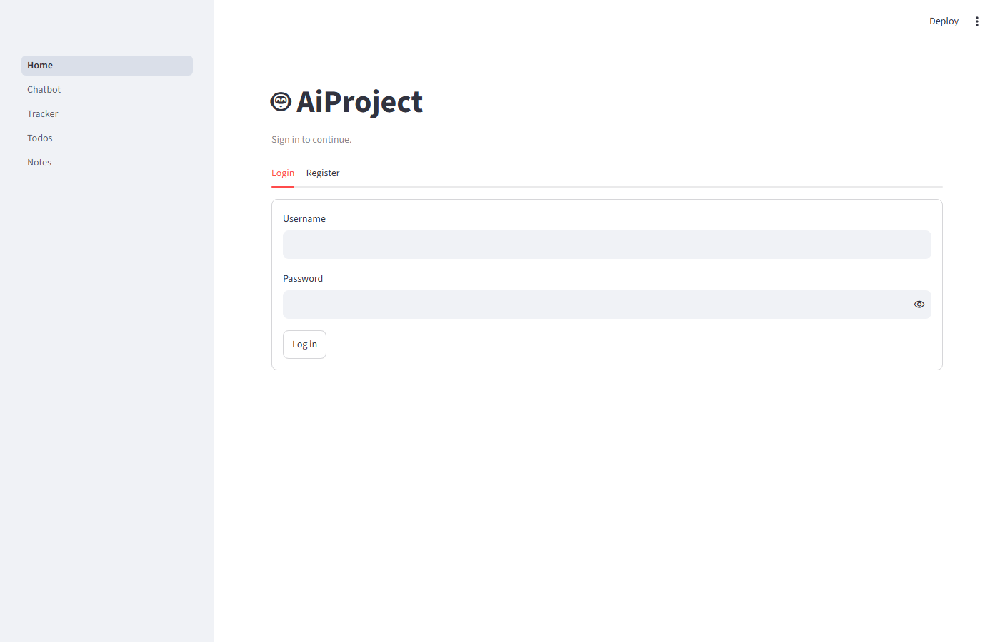
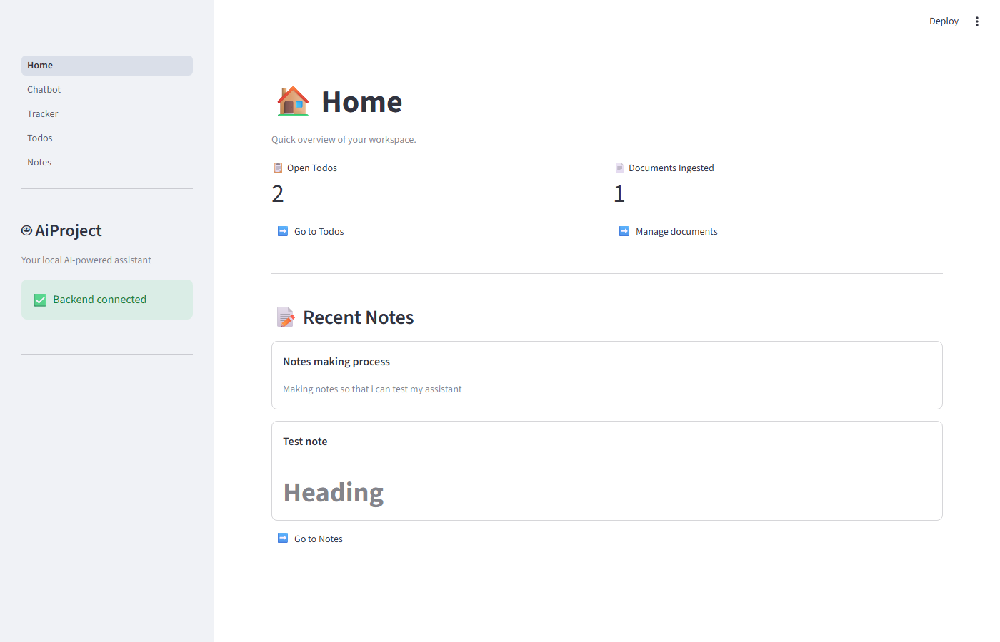
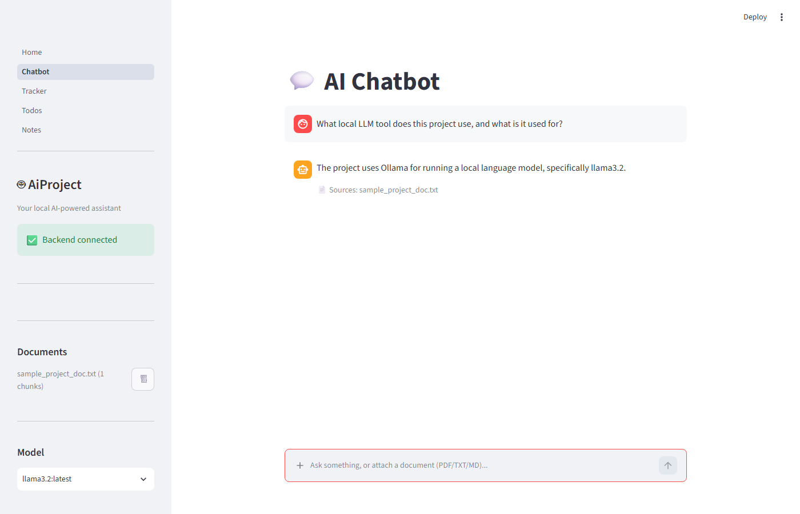
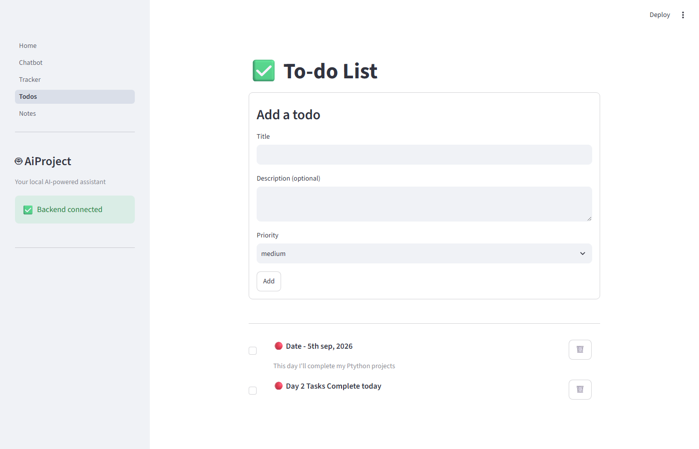
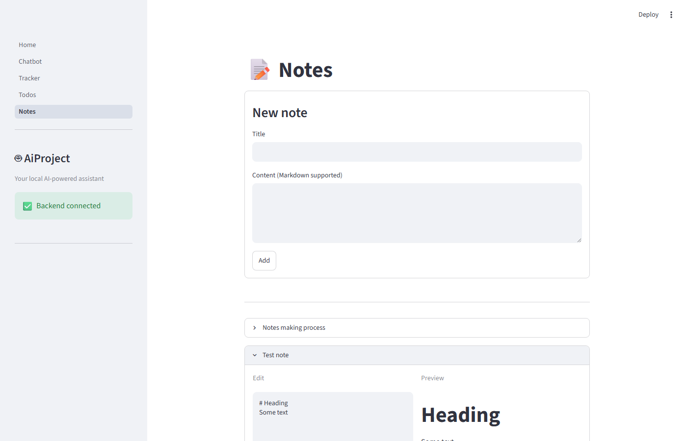
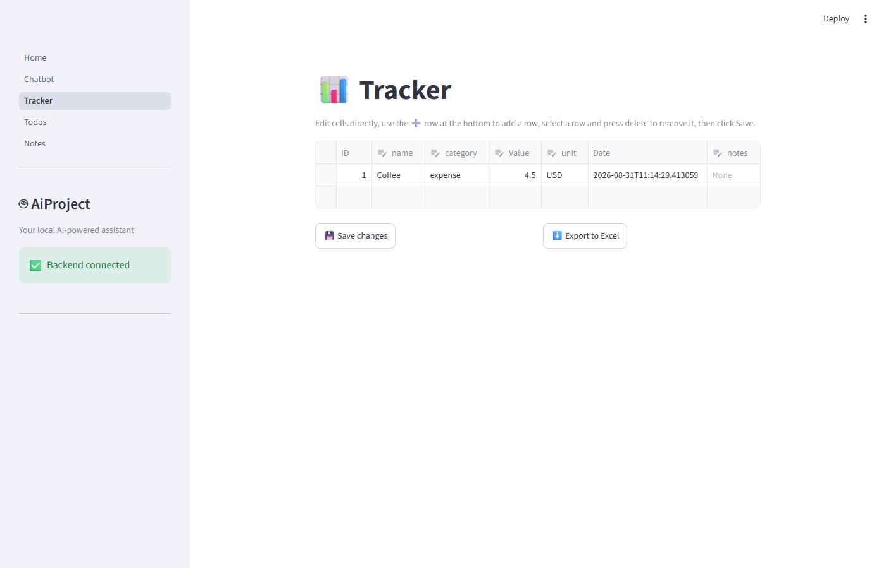

# AiProject

A local, self-hosted personal productivity assistant: an AI chatbot with document-grounded
answers (RAG), a to-do list, a notes app with markdown preview, and a habit/expense tracker —
all backed by your own machine, your own data, and a locally-running LLM.

## Features

- **Multi-user accounts** — register/log in; every user's todos, notes, tracker rows, uploaded
  documents, and chat/RAG data are fully isolated from every other user's.
- **AI Chatbot** — ask questions about documents you upload; answers are grounded in their
  content via Retrieval-Augmented Generation, streamed token-by-token, with source citations.
  Attach a PDF/TXT/MD file directly from the chat box to add it to that chat's knowledge base —
  **documents are scoped per chat**, so a file you attach in one conversation is never visible or
  searchable from another; start a new chat and it has zero access to any other chat's documents.
  Conversations are saved as chat history — pick up an old chat from the sidebar and it
  continues with full context, or start a fresh one with "New Chat". A "Save chat as note"
  button snapshots the current conversation into your Notes (a one-time copy, not a live link —
  it won't change if you keep chatting afterward).
- **To-do List** — checkboxes, color-coded priorities (🔴 high / 🟡 medium / 🟢 low).
- **Notes** — markdown editor with a live side-by-side preview.
- **Tracker** — a spreadsheet-style grid (add/edit/delete rows inline) with Excel export.
- **Home dashboard** — at-a-glance stats: open todos, ingested document count, recent notes.

## Architecture

```
Streamlit frontend  →  FastAPI backend  →  Postgres (data)
  (4 pages)                │            →  ChromaDB + Ollama (RAG / local LLM)
                            └── talks to Ollama running natively on the host
```

- **Frontend**: Streamlit multi-page app, calling the backend over plain HTTP.
- **Backend**: FastAPI + SQLAlchemy, exposing REST endpoints for auth/todos/notes/tracker/documents/chat.
- **Auth**: JWT-based — every protected endpoint requires a `Bearer` token obtained via `/auth/login`,
  and every query is scoped to the authenticated user (`user_id` on every row, plus a `user_id`
  metadata filter on every ChromaDB vector).
- **Data layer**: Postgres for structured data (users, todos, notes, tracker rows, document
  metadata, chat sessions/messages). Each document belongs to exactly one chat session.
- **AI layer**: LangChain + ChromaDB (vector store) + Ollama (local LLM and embedding model).
  Every vector chunk is tagged with both `user_id` and `session_id`, so retrieval for a chat
  only ever searches documents attached to that specific chat.

## Tech stack

| Layer | Tech |
|---|---|
| Frontend | Streamlit |
| Backend | FastAPI, SQLAlchemy |
| Database | PostgreSQL |
| RAG | LangChain, ChromaDB |
| LLM | Ollama (`llama3.2` chat, `nomic-embed-text` embeddings) |
| Containerization | Docker Compose |

## Prerequisites

- [Docker Desktop](https://www.docker.com/products/docker-desktop/)
- [Ollama](https://ollama.com/download) installed **natively on your host machine** (not
  containerized — the backend container reaches it via `host.docker.internal`), with the
  required models pulled:
  ```
  ollama pull llama3.2
  ollama pull nomic-embed-text
  ```

## Setup & running

1. Clone the repo and copy the environment template:
   ```
   cp .env.example .env
   ```
   Edit `.env` and set your own `POSTGRES_USER` / `POSTGRES_PASSWORD` / `JWT_SECRET_KEY` (generate
   one with `python -c "import secrets; print(secrets.token_hex(32))"` — never reuse the example
   value or commit a real one).

2. Make sure Ollama is running (it starts automatically after install on most systems; verify
   with `ollama list`).

3. Start everything:
   ```
   docker compose up -d --build
   ```

4. Open the app at http://localhost:8501 and **register an account** — the app is gated behind
   login, so this is required before you can use any page. FastAPI docs (Swagger UI) are at
   http://localhost:8000/docs, where every endpoint except `/auth/register` and `/auth/login`
   requires an `Authorization: Bearer <token>` header (use the "Authorize" button in Swagger UI
   after logging in via `/auth/login`).

To stop everything: `docker compose down` (add `-v` to also wipe the database/vector store volumes).

## Local development (without Docker)

Each service has its own virtual environment and can be run directly for faster iteration:

```
# Backend
cd backend
python -m venv venv
./venv/Scripts/pip install -r requirements.txt
./venv/Scripts/python -m uvicorn app.main:app --reload

# Frontend (separate terminal)
cd frontend
python -m venv venv
./venv/Scripts/pip install -r requirements.txt
./venv/Scripts/python -m streamlit run Home.py
```

You'll also need Postgres reachable locally — `docker compose up -d postgres` starts just the
database container while you run the backend/frontend natively.

## Project structure

```
AiProject/
├── backend/
│   ├── app/
│   │   ├── main.py          # FastAPI app entrypoint
│   │   ├── database.py      # SQLAlchemy engine/session setup
│   │   ├── models.py        # ORM models (User, Todo, Note, TrackerRow, Document)
│   │   ├── schemas.py       # Pydantic request/response schemas
│   │   ├── crud.py          # Database CRUD helpers (all scoped by user_id)
│   │   ├── auth.py          # Password hashing, JWT issuing/verification, get_current_user
│   │   ├── rag/             # RAG pipeline (ingestion, vector store, chain)
│   │   └── routers/         # API endpoints, grouped by resource (incl. auth.py)
│   ├── Dockerfile
│   └── requirements.txt
├── frontend/
│   ├── Home.py               # Dashboard entrypoint
│   ├── pages/                # Chatbot, Tracker, Todos, Notes
│   ├── api_client.py         # HTTP client wrapping the backend API (attaches the JWT)
│   ├── auth_ui.py            # Login/register gate shown before any page renders
│   ├── sidebar.py            # Shared sidebar chrome
│   ├── stats.py              # Dashboard stat helpers
│   ├── Dockerfile
│   └── requirements.txt
├── docker-compose.yml
└── .env.example
```

## Screenshots

### Login / Register


### Home dashboard


### AI Chatbot


### To-do List


### Notes


### Tracker

